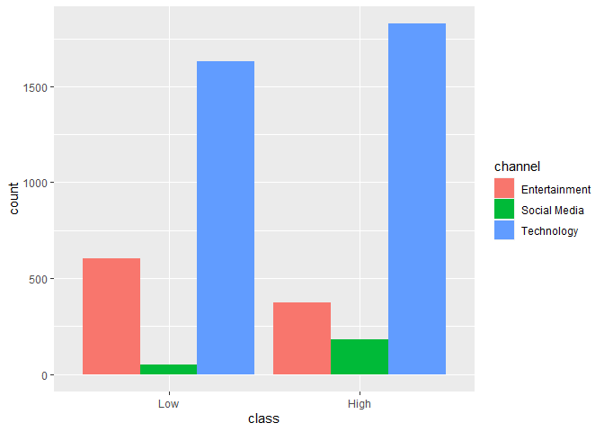
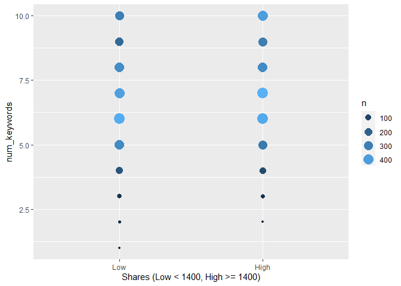
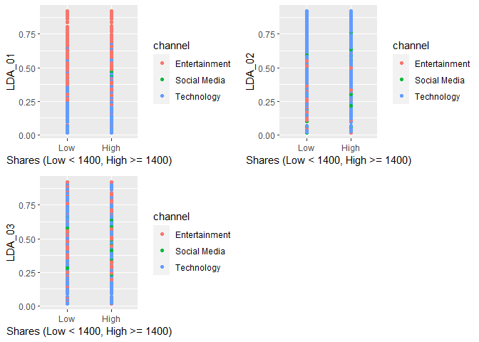
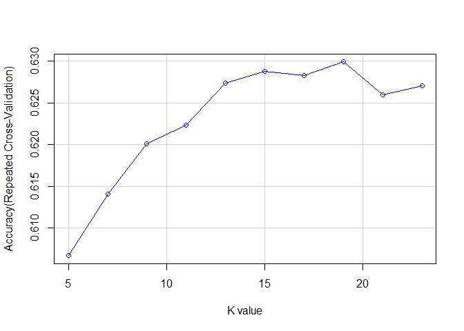
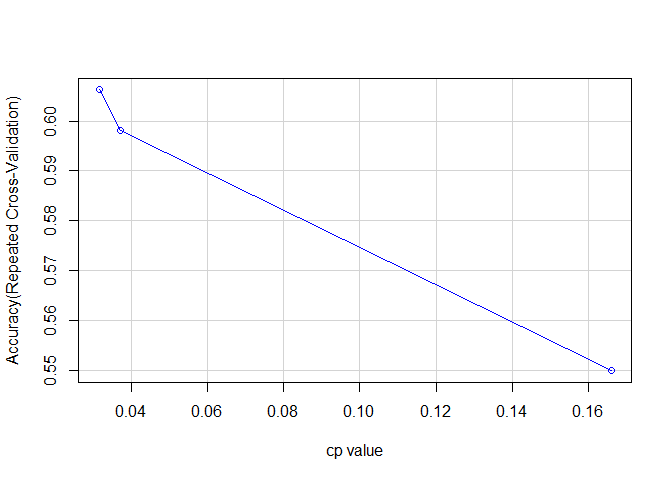
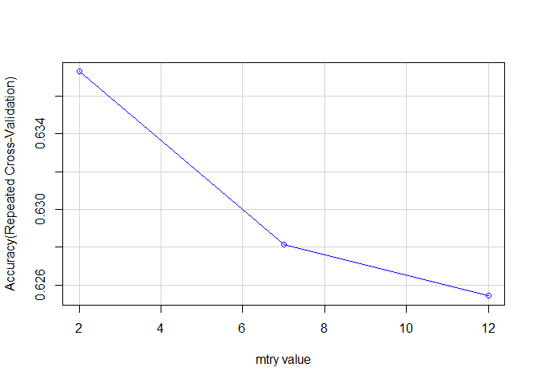

Thursday's Predictions
================
Lauren Witek
7/3/2020

  - [Introduction](#introduction)
      - [Purpose](#purpose)
  - [Data Analysis](#data-analysis)
      - [Reading in the data and setting up the train and test
        groups](#reading-in-the-data-and-setting-up-the-train-and-test-groups)
      - [Data Plots and Summarizations](#data-plots-and-summarizations)
      - [k Nearest Numbers](#k-nearest-numbers)
      - [Classification Tree](#classification-tree)
      - [Random Forest](#random-forest)

# Introduction

The dataset being used for this anaylsis can be found at [Online News
Popularity Data
Set](https://archive.ics.uci.edu/ml/datasets/Online+News+Popularity).

This data set has information from articles that were published by
[Mashable](www.mashable.com). It doe not contain the original content
but some statistics associated with it.

There are in total 58 predictive attributes and 1 goal field. I have
narrowed down those attributes to 13 using linear modeling selection
techniques. The following variables are used in the analysis:

*num\_hrefs: Number of links *num\_keywords: Number of keywords in the
metadata *kw\_max\_avg: Avg. keyword (max. shares) *kw\_avg\_avg: Avg.
keyword (avg. shares)  
*self\_reference\_max\_shares: Max. shares of referenced articles in
Mashable *LDA\_01: Closeness to LDA topic 1  
*LDA\_02: Closeness to LDA topic 2  
*LDA\_03: Closeness to LDA topic 3  
*title\_subjectivity: Title subjectivity  
*data\_channel\_is\_entertainment: Is data channel ‘Entertainment’?
*data\_channel\_is\_socmed: Is data channel ‘Social Media’?
*data\_channel\_is\_tech: Is data channel ‘Tech’? \*shares

## Purpose

The purpose of this analysis is to find the best model for predicting
values for the `shares` variable. The three models I will be using are k
Nearest Neighbors, Classification Tree, and Random Forest.

# Data Analysis

## Reading in the data and setting up the train and test groups

``` r
news <- read_csv("C:\\Users\\Lauren\\Documents\\ST558\\Project 2\\OnlineNewsPopularity.csv")

news$class <- if_else(news$shares < 1400, 0, 1)
news$class <- factor(news$class, levels = c(0, 1), labels = c("Low", "High"))

newsies <- news %>% filter(weekday_is_monday == 1) %>% select(class, num_hrefs, num_keywords, kw_max_avg, kw_avg_avg, self_reference_max_shares, LDA_01, LDA_02, LDA_03, title_subjectivity, data_channel_is_entertainment, data_channel_is_socmed, data_channel_is_tech)

set.seed(50)
train <- sample(1:nrow(newsies), size = nrow(newsies)*0.7)
test <- dplyr::setdiff(1:nrow(newsies), train)

newsTrain <- newsies[train, ]
newsTest <- newsies[test, ]
```

Creating a new data set to easier visualize the the three channel
groups.

``` r
channel <- newsTrain %>% mutate(channel = ifelse(newsTrain$data_channel_is_entertainment == 1, "Entertainment", 
                                     ifelse(newsTrain$data_channel_is_socmed == 1, "Social Media", "Technology")))
```

## Data Plots and Summarizations

This table shows the averages for the Title Subjectivity, Number of
Links, Average Keyword Max Shares, the Average Keyword Average Shares,
and the total for each of the classes.

``` r
kable(newsies %>% group_by(class) %>% summarise(Avg_Title_Subj = mean(title_subjectivity), Avg_Num_Links = mean(num_hrefs), Avg_Max_Shares = mean(kw_max_avg), Avg_Shares = mean(kw_avg_avg),  n = n()))
```

| class | Avg\_Title\_Subj | Avg\_Num\_Links | Avg\_Max\_Shares | Avg\_Shares |    n |
| :---- | ---------------: | --------------: | ---------------: | ----------: | ---: |
| Low   |        0.2644567 |        9.766667 |         5077.641 |    2851.396 | 3270 |
| High  |        0.2859461 |       11.675612 |         6063.780 |    3291.792 | 3391 |

This graph shows the count of low and high shares per channel type.

``` r
ggplot(channel, aes(x=class, fill = channel)) +
  geom_bar(position = "dodge")
```

<!-- -->

This plots shows the number of keywords in the metadata by the class.

``` r
ggplot(newsTrain, aes(x = class, y = num_keywords)) + 
  geom_count(aes(color = ..n.., size = ..n..)) +
  guides(color = "legend") +
  labs(x = "Shares (Low < 1400, High >= 1400)")
```

<!-- -->

This plot shows the scores for each of the channels for `LDA_01`,
`LDA_02`, and `LDA_03`. It also is broken down by the amount of shares.

``` r
p1 <- ggplot(channel, aes(x = class, y = LDA_01)) + 
  geom_point(aes(color = channel)) + 
  labs(x = "Shares (Low < 1400, High >= 1400)")

p2 <- ggplot(channel, aes(x = class, y = LDA_02)) + 
  geom_point(aes(color = channel)) +
  labs(x = "Shares (Low < 1400, High >= 1400)")

p3 <- ggplot(channel, aes(x = class, y = LDA_03)) + 
  geom_point(aes(color = channel)) +
  labs(x = "Shares (Low < 1400, High >= 1400)")

plot_grid(p1, p2, p3)
```

<!-- -->

## k Nearest Numbers

For k Nearest Neighbors, the idea is that you want to find the “closest”
k observations from the training set to predict the class set (“low”,
“high”). Each point will be classified (or predicted) to the class
with the highest probability.

Fitting the model and calculation the resampling based on
cross-validation.

``` r
trctrl <- trainControl(method = "repeatedcv", number = 10, repeats = 3)

set.seed(10)

knnFit <- train(class ~ ., data = newsTrain, method = "knn",
                trControl = trctrl, 
                preProcess = c("center", "scale"),
                tuneLength = 10
                )
knnFit
```

    ## k-Nearest Neighbors 
    ## 
    ## 4662 samples
    ##   12 predictor
    ##    2 classes: 'Low', 'High' 
    ## 
    ## Pre-processing: centered (12), scaled (12) 
    ## Resampling: Cross-Validated (10 fold, repeated 3 times) 
    ## Summary of sample sizes: 4196, 4195, 4196, 4195, 4196, 4196, ... 
    ## Resampling results across tuning parameters:
    ## 
    ##   k   Accuracy   Kappa    
    ##    5  0.6066747  0.2131216
    ##    7  0.6140402  0.2279667
    ##    9  0.6201150  0.2400987
    ##   11  0.6223323  0.2444746
    ##   13  0.6274079  0.2547200
    ##   15  0.6287665  0.2574031
    ##   17  0.6282664  0.2565134
    ##   19  0.6299096  0.2598498
    ##   21  0.6259771  0.2521438
    ##   23  0.6270485  0.2542625
    ## 
    ## Accuracy was used to select the optimal model using the largest value.
    ## The final value used for the model was k = 19.

Plotting the variation in accuracy of the repeated cross-validation of
`knnFit` with respect to the k values.

``` r
plot(knnFit$results[,1], knnFit$results[,2], xlab = "K value",
     ylab = "Accuracy(Repeated Cross-Validation)", 
     type = "o", col = "blue",
     panel.first = grid(lty = 1)
     )
```

<!-- -->

`knnFit` is trained with the best k value. Next the predicted values of
class for the test data set are pulled.

``` r
testPred <- predict(knnFit, newdata = newsTest)
```

The model accuracy for `knnFit`.

``` r
knnFitMat <- confusionMatrix(testPred, newsTest$class)
knnFitMat
```

    ## Confusion Matrix and Statistics
    ## 
    ##           Reference
    ## Prediction Low High
    ##       Low  590  354
    ##       High 397  658
    ##                                           
    ##                Accuracy : 0.6243          
    ##                  95% CI : (0.6027, 0.6456)
    ##     No Information Rate : 0.5063          
    ##     P-Value [Acc > NIR] : <2e-16          
    ##                                           
    ##                   Kappa : 0.2481          
    ##                                           
    ##  Mcnemar's Test P-Value : 0.1254          
    ##                                           
    ##             Sensitivity : 0.5978          
    ##             Specificity : 0.6502          
    ##          Pos Pred Value : 0.6250          
    ##          Neg Pred Value : 0.6237          
    ##              Prevalence : 0.4937          
    ##          Detection Rate : 0.2951          
    ##    Detection Prevalence : 0.4722          
    ##       Balanced Accuracy : 0.6240          
    ##                                           
    ##        'Positive' Class : Low             
    ## 

Calculation of the misclassification rate for the `knnFit` model.

``` r
tbl1 <- knnFitMat$table

misClass <- 1 - sum(diag(tbl1))/sum(tbl1)
misClass
```

    ## [1] 0.3756878

## Classification Tree

Classification trees are also used to predict group membership. For any
given region, the most prevalent case will be used for prediction.

Fitting the model and calculation the resampling based on
cross-validation.

``` r
set.seed(50)

classTree <- train(class ~ ., data = newsTrain,
                    method = "rpart",
                    trControl = trctrl, 
                    preProcess = c("center", "scale")
                )

classTree
```

    ## CART 
    ## 
    ## 4662 samples
    ##   12 predictor
    ##    2 classes: 'Low', 'High' 
    ## 
    ## Pre-processing: centered (12), scaled (12) 
    ## Resampling: Cross-Validated (10 fold, repeated 3 times) 
    ## Summary of sample sizes: 4195, 4196, 4196, 4196, 4196, 4195, ... 
    ## Resampling results across tuning parameters:
    ## 
    ##   cp          Accuracy   Kappa    
    ##   0.03153745  0.6062467  0.2132104
    ##   0.03723171  0.5981685  0.1966862
    ##   0.16600964  0.5499183  0.0922053
    ## 
    ## Accuracy was used to select the optimal model using the largest value.
    ## The final value used for the model was cp = 0.03153745.

Plotting the variation in accuracy of the repeated cross-validation of
`classTree` with respect to the cp value.

``` r
plot(classTree$results[,1], classTree$results[,2], xlab = "cp value",
     ylab = "Accuracy(Repeated Cross-Validation)", 
     type = "o", col = "blue",
     panel.first = grid(lty = 1)
     )
```

<!-- -->

`classTree` is trained with the best cp value. Next the predicted values
of class for the test data set are pulled.

``` r
classPred <- predict(classTree, newdata = newsTest)
```

The model accuracy for `classTree`.

``` r
classFitMat <- confusionMatrix(classPred, newsTest$class)
classFitMat
```

    ## Confusion Matrix and Statistics
    ## 
    ##           Reference
    ## Prediction Low High
    ##       Low  487  330
    ##       High 500  682
    ##                                           
    ##                Accuracy : 0.5848          
    ##                  95% CI : (0.5628, 0.6065)
    ##     No Information Rate : 0.5063          
    ##     P-Value [Acc > NIR] : 1.110e-12       
    ##                                           
    ##                   Kappa : 0.1677          
    ##                                           
    ##  Mcnemar's Test P-Value : 4.462e-09       
    ##                                           
    ##             Sensitivity : 0.4934          
    ##             Specificity : 0.6739          
    ##          Pos Pred Value : 0.5961          
    ##          Neg Pred Value : 0.5770          
    ##              Prevalence : 0.4937          
    ##          Detection Rate : 0.2436          
    ##    Detection Prevalence : 0.4087          
    ##       Balanced Accuracy : 0.5837          
    ##                                           
    ##        'Positive' Class : Low             
    ## 

Calculation of the misclassification rate for the `classTree` model.

``` r
tbl2 <- classFitMat$table

misClass2 <- 1 - sum(diag(tbl2))/sum(tbl2)
misClass2
```

    ## [1] 0.4152076

The chart shows the model accuracy and the misclassification for both
the k Nearest Neighbors and the Classification Tree.

``` r
matrix(c(paste0(round(knnFitMat$overall[1]*100, 2), "%"), 
         paste0(round(classFitMat$overall[1]*100, 2), "%"), 
         round(misClass, 3), round(misClass2, 3)), 
       ncol = 2, nrow = 2,
       dimnames = list(c("k Nearest Neighbors", "Classification Tree"), 
                       c("Model Accuracy", "Misclassification"))
       )
```

    ##                     Model Accuracy Misclassification
    ## k Nearest Neighbors "62.43%"       "0.376"          
    ## Classification Tree "58.48%"       "0.415"

## Random Forest

Random Forests create multiple trees from bootstrap samples and then
average the results. They use a random subset of predictors for each
tree fit. The reason for the random sampling is so that a strong
predictor (or two) won’t dominate the tree fits. This makes Random
Forests predictions less correlated than if we were doing a Bagged Tree.

Fitting the model and calculating the resampling based on
cross-validation

``` r
set.seed(50)

rfTree <- train(class ~ ., data = newsTrain, 
                  method = "rf",
                  trControl = trctrl, 
                  preProcess = c("center", "scale")
                )

rfTree
```

    ## Random Forest 
    ## 
    ## 4662 samples
    ##   12 predictor
    ##    2 classes: 'Low', 'High' 
    ## 
    ## Pre-processing: centered (12), scaled (12) 
    ## Resampling: Cross-Validated (10 fold, repeated 3 times) 
    ## Summary of sample sizes: 4195, 4196, 4196, 4196, 4196, 4195, ... 
    ## Resampling results across tuning parameters:
    ## 
    ##   mtry  Accuracy   Kappa    
    ##    2    0.6372848  0.2742746
    ##    7    0.6281342  0.2559792
    ##   12    0.6254174  0.2506591
    ## 
    ## Accuracy was used to select the optimal model using the largest value.
    ## The final value used for the model was mtry = 2.

Plotting the variation in accuracy of the repeated Bootstrap of `rfTree`
with respect to the mtry value

``` r
plot(rfTree$results[,1], rfTree$results[,2], xlab = "mtry value",
     ylab = "Accuracy(Repeated Cross-Validation)", 
     type = "o", col = "blue",
     panel.first = grid(lty = 1)
     )
```

<!-- -->

`rfTree` is trained with the best mtry value. Next the predicted values
of class for the test data set are pulled.

``` r
rfPred <- predict(rfTree, newdata = newsTest)
```

Model accuracy for the `rfTree`.

``` r
rfFitMat <- confusionMatrix(rfPred, newsTest$class)
rfFitMat
```

    ## Confusion Matrix and Statistics
    ## 
    ##           Reference
    ## Prediction Low High
    ##       Low  580  346
    ##       High 407  666
    ##                                           
    ##                Accuracy : 0.6233          
    ##                  95% CI : (0.6017, 0.6446)
    ##     No Information Rate : 0.5063          
    ##     P-Value [Acc > NIR] : < 2e-16         
    ##                                           
    ##                   Kappa : 0.2459          
    ##                                           
    ##  Mcnemar's Test P-Value : 0.02878         
    ##                                           
    ##             Sensitivity : 0.5876          
    ##             Specificity : 0.6581          
    ##          Pos Pred Value : 0.6263          
    ##          Neg Pred Value : 0.6207          
    ##              Prevalence : 0.4937          
    ##          Detection Rate : 0.2901          
    ##    Detection Prevalence : 0.4632          
    ##       Balanced Accuracy : 0.6229          
    ##                                           
    ##        'Positive' Class : Low             
    ## 

Calculation of the misclassification rate for the `classTree` model.

``` r
tbl3 <- rfFitMat$table

misClass3 <- 1 - sum(diag(tbl3))/sum(tbl3)
misClass3
```

    ## [1] 0.3766883

This chart shows the model accuracy and the misclassification rate for
the k Nearest Neighbors, the Classification Tree, and the Random
Forests.

``` r
matrix(c(paste0(round(knnFitMat$overall[1]*100, 2), "%"), 
         paste0(round(classFitMat$overall[1]*100, 2), "%"),
         paste0(round(rfFitMat$overall[1]*100, 2), "%"),
         round(misClass, 3), round(misClass2, 3), round(misClass3, 3)), 
       ncol = 2, nrow = 3,
       dimnames = list(c("k Nearest Neighbors", "Classification Tree", "Random Forest" ), 
                       c("Model Accuracy", "Misclassification"))
       )
```

    ##                     Model Accuracy Misclassification
    ## k Nearest Neighbors "62.43%"       "0.376"          
    ## Classification Tree "58.48%"       "0.415"          
    ## Random Forest       "62.33%"       "0.377"
